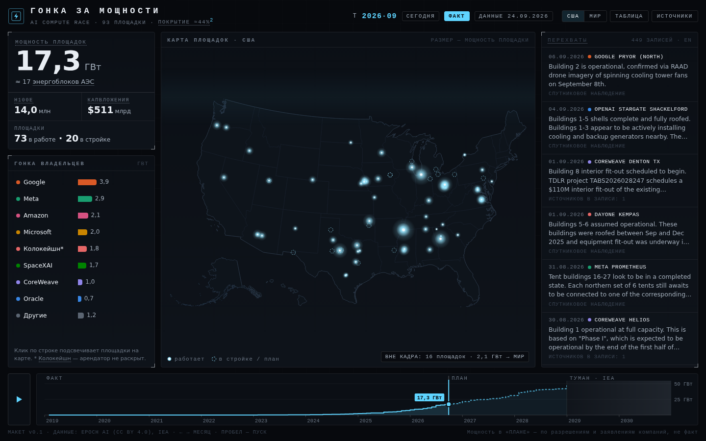

# Гонка за мощности

**AI compute race — один кинематографичный экран о том, как строятся AI-датацентры, 2019–2030**

Статус: макет v0.1 · 27.09.2026 · pet-проект, разовая визуализация



> **Сейчас здесь идёт работа над эксплейнером «Счёт за интеллект»** — аналитической страницей, для которой этот экран служит вступлением. План — `docs/content-plan.md`, реестр проверенных цифр — `data/claims.csv`, прототип — `prototype/index.html`, контент-пакеты блоков — `content/`. Вёрстка ведётся в облачной сессии Claude Code по инструкциям из `CLAUDE.md`.

---

## Идея

Гонка за AI-вычисления — это физика. Бетон, турбины, градирни, гигаватты. Экран показывает её так, как её видно со спутника и из разрешений на стройку. Площадки загораются на карте. Владельцы обгоняют друг друга. Бегущая строка «перехватов» сообщает, что изменилось на стройке. Ползунок времени ведёт от первых кластеров 2019 года к планам 2028-го и дальше в «туман».

Всё построено на открытых данных, прежде всего Epoch AI (CC BY 4.0). Из собственного здесь только монтаж.

## Формат

Это один экран в эстетике «оперативного центра», а не лонгрид. Он намеренно устроен иначе, чем эксплейнер про мозг мухи:

| | Эксплейнер про муху | Гонка за мощности |
|---|---|---|
| Форма | лонгрид с главами | один экран, дашборд |
| Навигация | скролл | ползунок времени и воспроизведение |
| Демки | отдельные интерактивы по ходу текста | весь экран и есть демка |
| Текст | авторский | минимум: подписи, термины, «перехваты» из данных |

Это самодостаточный `index.html` (~0,7 МБ). D3, картосновы и данные встроены, так что файл открывается без интернета в любом браузере и им можно поделиться.

## Что на экране

1. **Шапка.** Текущая точка на шкале времени (T 2026·09), сдвиг от сегодняшнего дня, режим (ФАКТ, ПЛАН или ТУМАН), дата выгрузки данных. Справа переключатель «США / Мир», таблица, источники.
2. **Главная цифра.** Суммарная мощность площадок в ГВт и перевод в «≈ N энергоблоков АЭС». Под ней три показателя: H100-эквиваленты, капвложения и число площадок в работе и в стройке.
3. **Гонка владельцев.** Столбцы по компаниям: они растут и меняются местами. Цвет закреплён за компанией, а не за местом в рейтинге. Клик по строке подсвечивает площадки владельца на карте.
4. **Карта.** Площадки светятся, размер свечения соответствует мощности. Пунктирное кольцо означает стройку или план. На каждую новую запись о стройке на карте расходится «пинг». В режиме «США» есть счётчик площадок вне кадра с переходом на карту мира.
5. **Перехваты.** Лента записей Epoch о ходе стройки: что видно на снимке, что написано в разрешениях. Новые записи подсвечиваются. При наведении на запись площадка выделяется на карте.
6. **Шкала времени.** Кривая суммарной мощности с тремя зонами: сплошная линия — **ФАКТ** (до сегодня), пунктир — **ПЛАН** (до конца 2028), дымка — **ТУМАН** (2029–2030, дальше только агрегаты IEA). Управление: перетаскивание, стрелки (← → месяц, ↑ ↓ год), пробел запускает воспроизведение.

Научные термины (мощность площадки и PUE, H100e, капвложения, колокейшн, покрытие, IEA) снабжены всплывающими подсказками. Ссылки на данные ведут в раздел «Источники». У экрана есть табличный вид: все площадки на выбранную дату.

## Цифры, из которых складывается история

Все цифры посчитаны по выгрузке Epoch от 24.09.2026. «План» означает мощность, заявленную в разрешениях и сообщениях компаний.

| Момент | Мощность площадок | H100e | Капвложения |
|---|---|---|---|
| конец 2023 | 0,4 ГВт | 0,2 млн | $13 млрд |
| конец 2025 | 8,3 ГВт | 5,7 млн | $247 млрд |
| **сегодня (27.09.2026)** | **17,3 ГВт** | **14,0 млн** | **$511 млрд** |
| конец 2027, план | 31,3 ГВт | 34,1 млн | $913 млрд |
| конец 2028, план | 48,4 ГВт | 65,7 млн | $1,4 трлн |

Сюжетные повороты, которые видно при воспроизведении:

- **Взрыв 2024–2026.** За три года суммарная мощность вырастает в ~40 раз.
- **Смена лидера.** Сейчас впереди Google (3,9 ГВт). Oracle пока на 0,7 ГВт, но к концу 2028 года по планам выходит на 8,4 ГВт и обгоняет всех. Это площадки Stargate, которые Oracle строит для OpenAI.
- **Владелец ≠ пользователь.** Anthropic работает на площадках Amazon и SpaceXAI, OpenAI — на площадках Oracle и Microsoft. Это готовый второй слой для экрана (см. «Что дальше»).
- **Колокейшн.** ~5 ГВт в планах приходится на операторов вроде QTS и DayOne, чьи арендаторы не раскрыты.

## Данные

| Слой | Источник | Лицензия | Что берём |
|---|---|---|---|
| Площадки, таймлайны, заметки о стройке | [Epoch AI — AI data centers][1] | CC BY 4.0 | 93 площадки, 545 точек таймлайна (2018–2030), 545 заметок |
| Координаты | [Epoch Satellite Explorer][2] | CC BY 4.0 (как часть проекта) | `lngLat` каждой площадки из данных страницы; в CSV координат нет |
| Методология и покрытие | [Epoch — методология][3] | — | оценка мощности по охлаждению, покрытие ≈44% |
| Горизонт до 2030 | [IEA — Key Questions on Energy and AI][4] | CC BY 4.0 | 485 ТВт·ч (2025) → ~950 ТВт·ч (2030) по всем ДЦ мира |
| Картоснова | [world-atlas][5], [us-atlas][6] | public domain | границы стран и штатов США |

### Что важно знать о данных

- **Мощность площадки и IT-мощность — разные величины.** В таймлайнах `Power (MW)` — полная мощность площадки (серверы плюс охлаждение и потери), `IT power (MW)` — только серверы. Поле `Current power (MW)` в `data_centers.csv` — это **IT-мощность**. Поэтому сумма по нему даёт 13,5 ГВт, а сумма по таймлайнам — 17,3 ГВт. На экране везде мощность площадки, IT-мощность видна во всплывающей подсказке и в таблице.
- **Шкала ступенчатая.** Значение площадки держится от одного наблюдения до следующего, между точками ничего не интерполируется. Это честнее: Epoch фиксирует состояние на дату снимка или документа.
- **Текущий месяц обрезан по сегодняшнему дню,** иначе в «сегодня» попали бы планы на конец месяца.

## Ограничения и как экран их показывает

| Ограничение | Как показываем |
|---|---|
| 77 из 93 площадок в США, Китай почти не виден; база покрывает ≈44% мировых AI-вычислений (90% ДИ 23–81%) | главная ось — компании, а не страны; подсказка «покрытие» в шапке; счётчик «вне кадра» |
| После 2028 года почти нет наблюдений (2029 и 2030 — по одной точке) | зона «ТУМАН»: карта в дымке, приглушённые цифры, вместо площадок — агрегат IEA |
| Всё после сегодняшнего дня — планы | режим «ПЛАН», пунктир на шкале, пометка «ПЛАН» в ленте |
| Оценки по спутнику приблизительны (при сверке — 77–118% от известных значений) | в тексте и подсказках; в v1 можно добавить ореол неопределённости |
| Заметки Epoch на английском | в макете оригинал с пометкой «EN»; перевод — в планах |
| Лицензия спутниковых снимков Epoch не указана (часть куплена у SkyWatch, Vantor, Airbus, Vexcel) | снимки не встраиваем; для «до/после» — Sentinel-2 (Copernicus, бесплатно, 10 м) |

## Дизайн-решения

- **Тёмная тема — осознанно и только тёмная.** Это эстетика оперативного центра, светлой версии у экрана нет.
- **Цвета владельцев** — 8 категориальных слотов в фиксированном порядке. Палитра проверена валидатором на поверхности `#0f141b`: все проверки пройдены, включая различимость при дальтонизме (худшая пара ΔE 8,4). Строки гонки подписаны, так что цвет — не единственный канал.
- **Карта одноцветная** (холодное свечение). Цвет компании появляется на карте только при выборе строки. Восемь цветов точек на одной карте читались бы плохо.
- **Шрифты:** моноширинный для «приборов», системный sans для цифр. Никаких внешних шрифтов.
- **Доступность:** клавиатурное управление, табличный вид, `prefers-reduced-motion` отключает пинги и анимации. На мобильных шкала времени прилипает к низу экрана.

## Что в папке

```
data-race/
├── index.html            ← макет, открыть в браузере
├── README.md             ← это описание
├── docs/preview.png      ← скриншот
├── src/template.html     ← исходник экрана (HTML/CSS/JS без встроенных библиотек)
├── scripts/build.py      ← скачать свежие данные и пересобрать index.html
└── data/
    ├── data.json         ← компактные данные для экрана (снимок 24.09.2026)
    ├── coords.json       ← координаты площадок из Satellite Explorer
    ├── raw/epoch_data_centers.zip
    └── lib/              ← d3, topojson, картосновы (встраиваются при сборке)
```

**Пересборка:** `pip install pandas`, затем `python scripts/build.py`. Сборка скачает свежий архив Epoch и координаты, соберёт `data.json` и встроит всё в `index.html`. Ключ `--offline` собирает из уже скачанного. Перед пересборкой поправь `TODAY` и `RETRIEVED` в начале скрипта.

## Следующий шаг: эксплейнер «Счёт за интеллект»

Экран становится холодным стартом аналитического эксплейнера о том, кто платит за гонку и что мир получает взамен. План — [`docs/content-plan.md`](docs/content-plan.md), рисёрч-заметки с источниками — [`docs/research-notes-2026-09-27.md`](docs/research-notes-2026-09-27.md).

## Что дальше (к v1)

1. **Режим истории.** 5–6 остановок с подписью: «первые кластеры», «2024: взрыв», «сегодня», «Oracle обгоняет», «туман». Свободное исследование остаётся после тура.
2. **Второй слой «Кто считает».** Переключатель «владельцы / лаборатории» (OpenAI, Anthropic, Google DeepMind, Meta…), где уверенность связи показана пунктиром.
3. **Перевод «перехватов» на русский** с помощью LLM и выборочной проверкой. Оригинал доступен по клику.
4. **Сравнение масштаба со странами** по данным Ember (CC BY 4.0): «площадки 2028 года ≈ годовое потребление страны X» с явным допущением о загрузке.
5. **«До/после» со спутника** для 3–5 главных площадок на снимках Sentinel-2.
6. **Карточка для шеринга** (OG-картинка) и публикация на GitHub Pages.
7. **Масштаб и панорама на карте мира;** ореол неопределённости вокруг оценок мощности.

## Эксплейнер «Счёт за интеллект»: этап 0 (28.09.2026)

Прототип лежит в `prototype/index.html` — один файл, открывается двойным щелчком, без сети.

- Что внутри: вступление-штаб с переходом на бумагу (площадки собираются в сетку «1 точка = 100 МВт») и полностью готовая строка 06 «Почему интеллект дешевеет, а счёт — нет» с тремя графиками и счётом на полях.
- Строки 01–05 и 07–10 пока заглушки.
- План: `docs/content-plan.md` (v1.0). Проверенные цифры строки 06: `data/claims-06.csv`. Редактура: `docs/review-06.md`.
- Пересборка: `python3 prototype/build_proto.py` (шрифты из `prototype/fonts`, библиотеки из `data/lib`).

**Этап 1 (28.09.2026):** все цифры плана сверены с первоисточниками — реестр `data/claims.csv` (373 строки), итог и что меняется в плане — `docs/fact-check-2026-09-28.md`, пересчёты по сырым данным со скриптами — `data/recalc/`. Файл `data/claims-06.csv` — ранняя версия блока 06, целиком вошёл в `claims.csv`.

**Этап 2 (28.09.2026): каркас страницы.** Страница собирается из контент-пакетов одной командой:

```
pip install pyyaml
python scripts/build_site.py
```

Результат — `site/index.html`: один файл без сети в рантайме (шрифты, D3, topojson, картооснова и данные встроены), около 850 КБ. Исходники — `site/src/` (`page.html` — разметка и стили, `app.js` — тема, подсказки, счёт, переход «штаб → бумага», `charts/NN.js` — графики строк). Верстаются пакеты `content/NN-*.md` со статусом «готов к вёрстке», остальные строки — заглушки. Перед пересборкой поправь `EDITION` в начале скрипта.

Каркас следует плану v1.3: над штабом — преамбула из поля `preamble` пакета 00 (автопроигрывание карты ждёт, пока сцена не окажется на экране), строки 11–13 стоят на своих местах. Номера пакетов рабочие; на странице строки нумеруются по порядку — таблица `MANIFEST` и `DISPLAY_NO` в `scripts/build_site.py` (например, пакет 06 — «строка 08»).

Проверка по чек-листу (`pip install playwright`, `python -m playwright install chromium`; в облачной среде браузер уже стоит в `/opt/pw-browsers` — поставь версию Playwright под него, сейчас `pip install playwright==1.56.0`): `python scripts/check_site.py` — кадры 1440×900 (светлая и тёмная), 1024×768, 390×844 в `screens/`, проверка консоли, горизонтальной прокрутки, наездов подписей графиков и того, что счёт помещается в экран.

## Открытые вопросы

- Русский текст «перехватов» или оригинал? От этого зависят объём работы и тон экрана.
- Режим истории делать основным входом или опцией?
- Показывать ли в «тумане» что-то кроме агрегата IEA (например, объявленные, но не отслеживаемые Epoch проекты)?

## Источники

1. Epoch AI. [AI data centers — данные и загрузки][1]. Выгрузка от 24.09.2026, CC BY 4.0.
2. Epoch AI. [Satellite Explorer][2] — координаты и контуры площадок.
3. Epoch AI. [Методология Frontier Data Centers][3] — оценка мощности, покрытие 44% (90% ДИ 23–81%) на 26.09.2026.
4. IEA. [Key Questions on Energy and AI — Executive summary][4] (2026). CC BY 4.0.
5. [world-atlas][5] (Natural Earth) · 6. [us-atlas][6] (US Census) · [D3](https://d3js.org).

[1]: https://epoch.ai/data/ai-data-centers
[2]: https://epoch.ai/data/data-centers/satellite-explorer
[3]: https://epoch.ai/data/data-centers-documentation/methodology
[4]: https://www.iea.org/reports/key-questions-on-energy-and-ai/executive-summary
[5]: https://github.com/topojson/world-atlas
[6]: https://github.com/topojson/us-atlas
